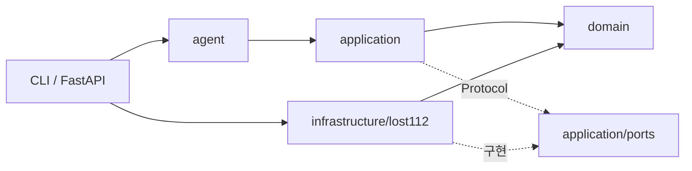

# JupJup 구조와 LangChain Middleware

## 의존 방향

- `domain`: Pydantic 모델, 후보 매칭, 신고서 작성과 개인정보 마스킹 규칙을 둡니다.
- `application`: 습득물 후보 조회와 유사 분실 신고 조회를 각각의 사용 사례로 분리합니다.
- `application/ports`: 외부 데이터 조회와 이미지 판정에 필요한 최소 인터페이스만 선언합니다.
- `infrastructure/lost112`: 경찰청 API 주소, XML 변환, HTTP·페이지·시간 제한 구현을 둡니다.
- `agent`: 사용자 의도 분석, Custom Tool, Middleware, Memory와 최종 응답 조립을 담당합니다.
- `web`: FastAPI 라우트와 외부 공개 DTO를 분리합니다.

기존 `jupjup.api_client`, `jupjup.models`, `jupjup.service` 등의 import 경로는 얇은 호환 모듈로 유지합니다. 새 내부 코드는 계층별 경로를 직접 사용합니다.

## Middleware 실행 경계

강의 노트의 node-style hook과 wrap-style hook 구분에 맞춰 책임을 배치했습니다.

| 단계 | 구현 | 역할 |
| --- | --- | --- |
| Agent 시작 전 | `@before_agent validate_user_input` | 빈 입력을 모델 호출 전에 종료 |
| 모델 호출 전후 | `@wrap_model_call` | 사용자 의도에 맞는 Tool만 공개하고 필요한 Tool 선택 강제 |
| Tool 실행 전후 | `@wrap_tool_call` | 물품명 검증, 이전 대화 조건 병합, 무단 신고서 Tool 차단 |
| Agent 종료 후 | `@after_agent validate_final_answer` | 실제로 하지 않은 신고 접수 완료 표현 교정 |
| 전체 실행 | 내장 Middleware | PII 보호, Tool 재시도, 모델·Tool 호출 횟수 제한 |

`before_agent`와 `after_agent`는 정해진 시점의 상태 검증에 사용합니다. 요청 객체나 실행 흐름을 감싸야 하는 Tool 공개 범위와 인자 병합은 `wrap_model_call`, `wrap_tool_call`에 유지합니다.
